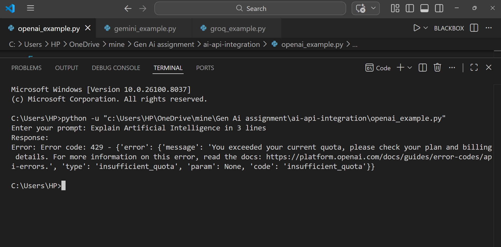
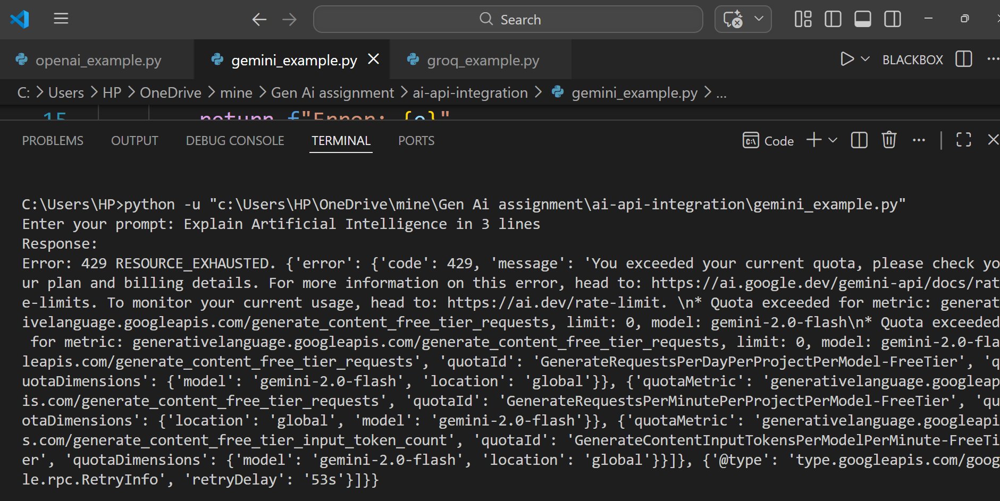
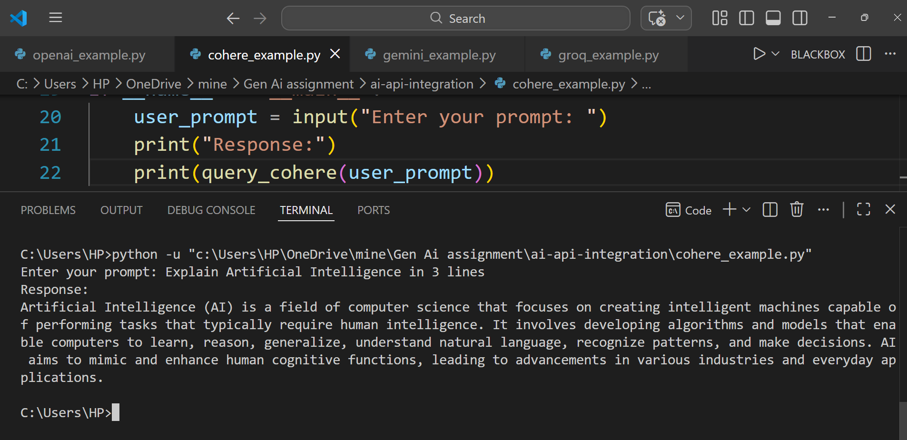
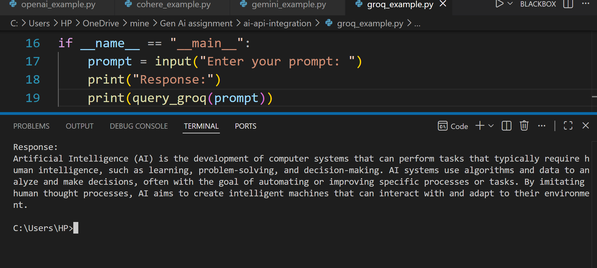
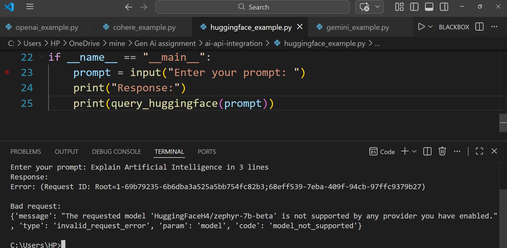
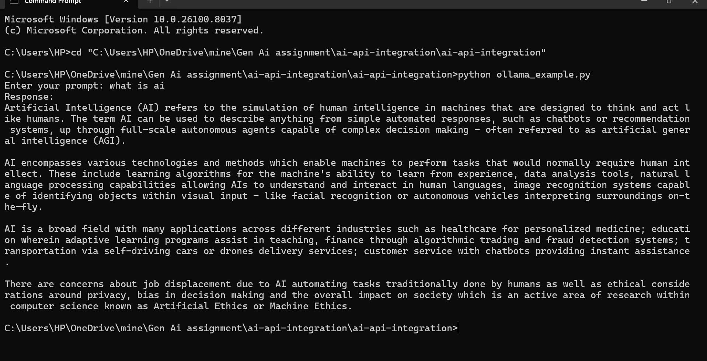

# AI API Integration Project

This project integrates multiple Generative AI APIs into a unified Python system, enabling prompt-based interaction across different AI models, including both cloud-based and local LLMs.

---

## Features

* Integration of multiple AI APIs in one system  
* Modular Python scripts for each API  
* Chatbot functionality using AI models  
* Support for both cloud-based and local models  
* Easy API key configuration  

---

## APIs Used

* OpenAI API  
* Google Gemini API  
* Cohere API  
* Groq API  
* HuggingFace API  
* Ollama (Local LLM)  

## Tech Stack

Python, OpenAI, Gemini, Cohere, Groq, HuggingFace, Ollama  

## Project Structure

```
ai-api-integration/
├── ai_chat.py
├── openai_example.py
├── gemini_example.py
├── cohere_example.py
├── groq_example.py
├── huggingface_example.py
├── ollama_example.py
├── requirements.txt
└── README.md
```

## Requirements

* Python 3.8 or higher  
* Internet connection for cloud APIs  
* Ollama installed (for local model)  

---

## Installation

```bash
pip install -r requirements.txt
```

## How to Run

```bash
python openai_example.py
python gemini_example.py
python cohere_example.py
python groq_example.py
python huggingface_example.py
python ollama_example.py
```

### For chatbot:

```bash
python ai_chat.py
```

## API Keys Setup

Set your API keys as environment variables:

* OPENAI_API_KEY  
* GOOGLE_API_KEY  
* COHERE_API_KEY  
* GROQ_API_KEY  
* HUGGINGFACE_API_KEY  

---

## Output Screenshots

### OpenAI


### Gemini


### Cohere


### Groq


### HuggingFace


### Ollama


---

## Example Use Cases

* AI chatbot development  
* Text generation  
* API integration  
* Local LLM usage  

---

## Author

Kanaka V Y  
B.E Artificial Intelligence & Machine Learning Student  
